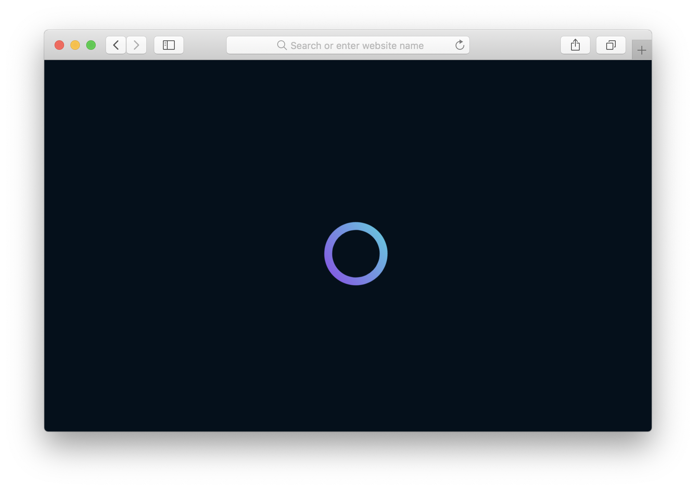

<i>A simple and scalable self-hosted Platform as a Service</i>

	
	
	
	
	
	

<code>curl https://get.orbit.sh | bash</code>

Orbit is designed to take the pain away from self-hosted web applications. With <b>conceptually simple cluster management</b> tools, a beautiful and powerful <b>web dashboard</b>, HTTP(S) edge-routing with built-in <b>Lets Encrypt</b> support, <b>git deployment</b>, <b>distributed block storage volumes</b> and <b>databases</b>, one-to-many node scalability, and much more.

